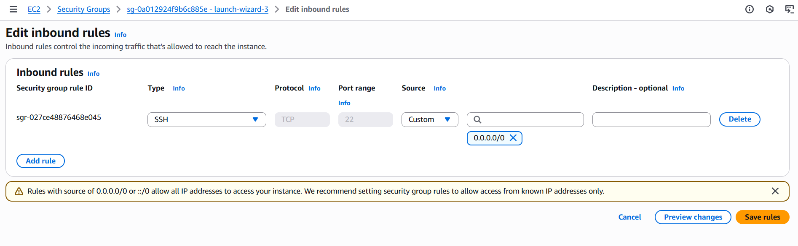

# PRACTICING DEPLOYMENT OF AN E-COMMERCE PLATFORM WITH GIT, LINUX AND AWS.

### Steps carried out
- created a directory for the app souce code
- initiated a git local repository ` git init `
- downloaded the a website template which is zipped and have to unzip it `unzip file_name `
- Create a remote repository on Github and connect with ` git remote add origin <repository URL> `
- stage and commit the downloaded template.

### Deploying site to Aws steps
- login to Aws management console an create and instance of EC2 running Amazon Linux AMI. Connect to instance using SSH.

- clone the repository on the Linux server choose between `SSH` and `HTTPS` for the connection.
click the `code` button to display the two connection methods.


- generate SSH keypair using  ` ssh-keygen `
to make the system create the ssh in a default file which is randomly generated, keep clicking enter to the end.


- display the content in the ssh file created using `cat` command

- using the `ssh-keygen` seems to prevent me from using the key generated cause github now using OPENSSH format, what i did was regenerate the `ssh` using a `ssh-keygen -t ed25519 -C "your_email@example.com"
`

- your ssh key will be at /home/ubuntu/.ssh/id_ed25519.pub. the .pub represent public, also the latest standard as of now is ed25519, previously it was id_rsa. 

- copy the content of the .pub file, paste it to github, name the key by your machine name. choose if its for oauthentication or signing in.

follow the steps in the images below to successfully add ssh key


- clone the repository `git clone git@github.com:username/MarketPeak_Ecommerce.git`

- install a web server
```
    sudo apt update 
    sudo apt install httpd 
    sudo systemctl start httpd
    sudo systemctl enable httpd
```
in debian based systems like ubuntu, you will have to make a decision cause httpd is just a name for all webservers. for me i chose ` apache2 ` 

> sudo apt update
> sudo apt install apache2 -y
> sudo systemctl start apache2
> sudo systemctl enable apache2


- configuration of the server
To serve the website fron EC2 instance, configure httpd( apache2 ) to point to the directory on the Linux server where the website code files are stored. the web root (/var/www/html) is the base folder on a server where your website's files (HTML, CSS, JS etc) are stored and served to the public via a web server like Apache or Nginx. Think of it as the home directory for your website. 

    - clear the default file in the web root 
    - copy the site files to the web root 
    `sudo rm -rf /var/www/html/*
sudo cp -r ~/MarketPeak_Ecommerce/* /var/www/html/`

- though not necessary since apache will automatically serve the files but you can reload the httpd using 

> sudo systemctl reload httpd

- we can view the web page by using ` http://<publlic ip of EC2>

- while trying to connect i came across
```
This site can’t be reached
--.--.91.49 took too long to respond.
``` 
error on my browser, i tried many ways to troubleshoot it such as checking for the status of apache2 using 
` sudo systemctl status apache2 `
 Finally i had to go set inbound to make port 80, and anywhere which although dangerous but for the learning phase which i am now, its okay.
 here are the steps i took.

 

 

 i also had to set inbound for ssh connection cause my mobaXterm lost connection when i change the default original inbound settings. 
 lets keep this commands and their default port at the back of our minds
 | Protocol | Default Port | Purpose                        |
| -------- | ------------ | ------------------------------ |
| SSH      | 22      | Secure remote login to servers |
| HTTP     | 80           | Serve unencrypted web traffic  |
| HTTPS    | 443          | Serve encrypted web traffic    |
| FTP      | 21           | Transfer files (old/unsecure)  |

the above picture show for HTTP.

- finally launch the site (http://< public ip address >)

    

# Role of devOps engineer include continous deployment, but since i haven't learnt how to automate it i will do it manually by ;
- make changes in the github
- pull changes to local repo
- transfer changes to web base /var/www/html
 
 lets go!

To better simulate this i made some changes on my vscode terminal to the global repo


pull the changes on mobaXterm.


i noticed that for folders within the /var/www/html are displayed in the absence of an index to html.
making cloning lesser of a good decision cause cloning will transfer the full folder there which can't
be opened unless we click it. i tried going around and end up using a temporary solution 
`  sudo cp -r * /var/www/html && sudo cp -r /var/www/html/templatemo_571_hexashop/*  /var/www/html/ `
it copy the file after pulling to the /var/www/html and at that point remove all the files in the files in the 
hexashop into the /html/ directory.


